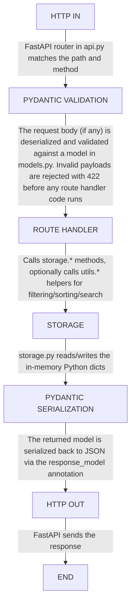

# **ARCHITECTURE**
+ PromptLab is a "Postman for Prompts" - a backend-only REST API for storing, organizing, and managing AI prompt templates. It;s a Python/FastAPI applicaiton with a deliberately simple flat architecture

```
HTTP Request
    └── FastAPI (api.py)
            ├── Pydantic validation (models.py)
            ├── Business logic / utilities (utils.py)
            └── In-memory storage (storage.py)
```

+ There is no database, no auth, no frontend, and no async I/O - it is a synchronous CRUD API.
+ The config.taml is not consumed by the backend at all
+ This is a standard 3-layer split: routes -> business logic/helpers -> storage
	+ This pattern will still be here when swapping the storage layer for a real database - the whole point of separating it out.

| FILE | FUNCTION |
| --- | --- |
| main.py | entry point, just boots uvicorn |
| app/api.py | HTTP Layer (FastAPI routes) |
| app/models.py | data shapes (Pydantic) |
| app/storage.py | data layer (in-memory dict, stands in for a DB |
| app/utils.py | pure helper functions (sorting, filtering, search) |

# **ENTRY POINTS**
+ The server starts in the backend/main.py file via uvicorn on 0.0.0.0:8000.
+ 11 routes registered in backend/app/api.py

| METHOD | PATH | STATUS |
| --- | --- | --- |
| GET | /health | Works |
| GET | /prompts | Works (sorting bug) |
| GET | /prompts/{id} | Bug 1: 500 on missing ID instead of 404 |
| POST | /prompts |  Works | 
| PUT | /prompts/{id} | Bug 2: updated_at not refreshed |
| PATCH | /prompts/{id} | Missing - noted in comment but not implemented |
| DELETE | /prompts/{id} | Works |
| GET | /collections | Works |
| GET | /collections/{id} | Works |
| POST | /collections | Works |
| DELETE | /collections/{id} | Bug 4: orphans child prompts |

# **DATA FLOW**
A request travels this path:


# MODELS & RATIONSHIPS
+ Defined in models.py
## **Prompt**
+ id: UUID (auto-generated)
+ title: str (1-200 chars, required)
+ content: str (min 1 char, required) - the actual prompt text, supports {{variable}} template syntax
+ description: optional str (max 500 chars)
+ collection_id: optional str - **foreign key by convention only. no referential integrity enforce**
+ created_at / updated_at: UTC datetimes (auto-set at creation)
## **Collection**
+ id: UUID (auto-generated)
+ name: str (1-100 chars, required)
+ description: optional str (max 500 chars)
+ created_at: UTC datetime
### **Relationship**
+ A Prompt optionally belongs to one Collection via collection_id. This is a soft reference - there is no join table, no cascade, and no enofrcement. Deleting a colleciton leaves its prompts with a dangling collection_id.
+ There are three model tiers per resource:
	1. \*Base (shared fields)
	2. \*Create (input, no id/timestamps)
	3. \* (full response, with id/timestamps).
+ PromptUpdate is identical to PromptCreate and requires all fields on evey PUT (no partial update / PATCH support).

# **STORAGE LAYER**
+ storage.py is a module-level singleton (storage = Storage()) backed by two plain dicts: \_prompts: Dict[str, Prompt] and \_collections: Dict[str, Collection], keyed by UUID string.
	+ **Zero persistence** - every restart wipes all data
	+ **No concurrency safety** - no locks; race conditions possible under load (FastAPI can run threaded workers)
	+ **Unbounded memory growth** - no eviction, no pagination at storage level
	+ **No query capability** - filtering/search is done by loading all records into memory and iterating (see utils.py)
+ The clear() method is used by test fixtures to reset state between test runs (good design choice)
+ get_prompts_by_collection() is implemented but unused - dead code.

# **EXTERNAL DEPENDENCIES**
+ Defined in requirements.txt

| PACKAGE | VERSION | ROLE |
| --- | --- | ---|
| fastapi | 0.109.0 | Web framework + routing + OpenAPI docs generation |
| uvicorn | 0.27.0 | ASGI server (runs FastAPI | 
| pydantic | 2.5.3 | Request/response validation and serialization |
| pytest | 7.4.4 | Test runer |
| pytest-cov | 4.1.0 | Test coverage reporting |
| httpx | 0.26.0 | HTTP client used by FastAPI's TestClient in tests |

# **CONTEXT STRATEGY**
## Task 1.2
+ For the first prompt, I made a general prompt along the lines of "You are a developer that just inherited this baserepo. Please explore this repo and discuss the following:" and then listed the parts I wanted to be brought up to speed on (i.e. architecture, data flow, etc.).
+ The first response was good, but I wanted some more detail, I decided to use clause in the web browser and follow the "Anatomy of an Effective Prompt" documentation. This method provided even more detail and was ultimately what helped me write this whole document and complete Task 1.2.
+ Afer the general prompt in my claude browser session, I narrowed the context and asked claude to explain the tests to me so I would know how to properly test whether my changes were breaking things or working.

## Task 1.4
+ I wanted AI to help me write the docstring for this function I edited, so I highlighted the function in the file and asked Claude Code (plan mode) to write a Google-style docsting with Args, Returns, and Raises in alignment with the actual implementaiton of the function.
## Task 1.5
+ I highlighted the identified bug in utils.py and provided the following prompt to Claude Code:
> def sort_prompts_by_date(prompts: List[Prompt], descending: bool = True) -> List[Prompt]:
>    """Sort prompts by creation date."""
>    return sorted(prompts, key=lambda p: p.created_at, reverse=descending)

